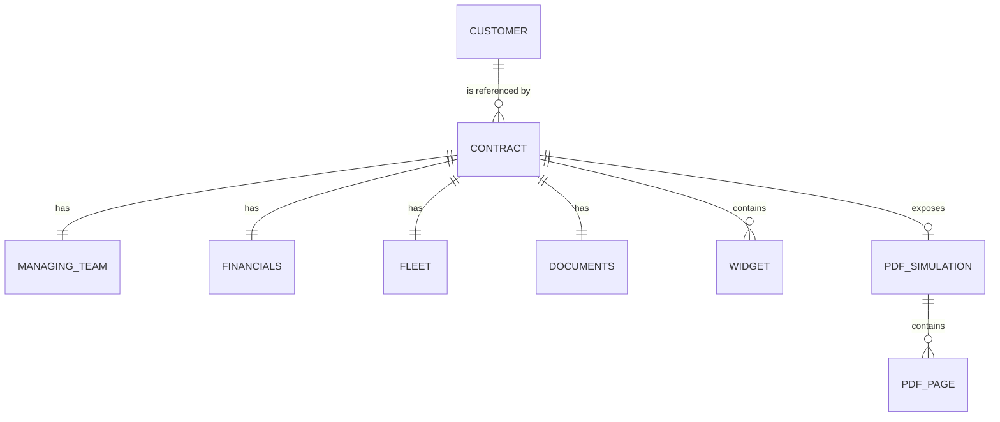
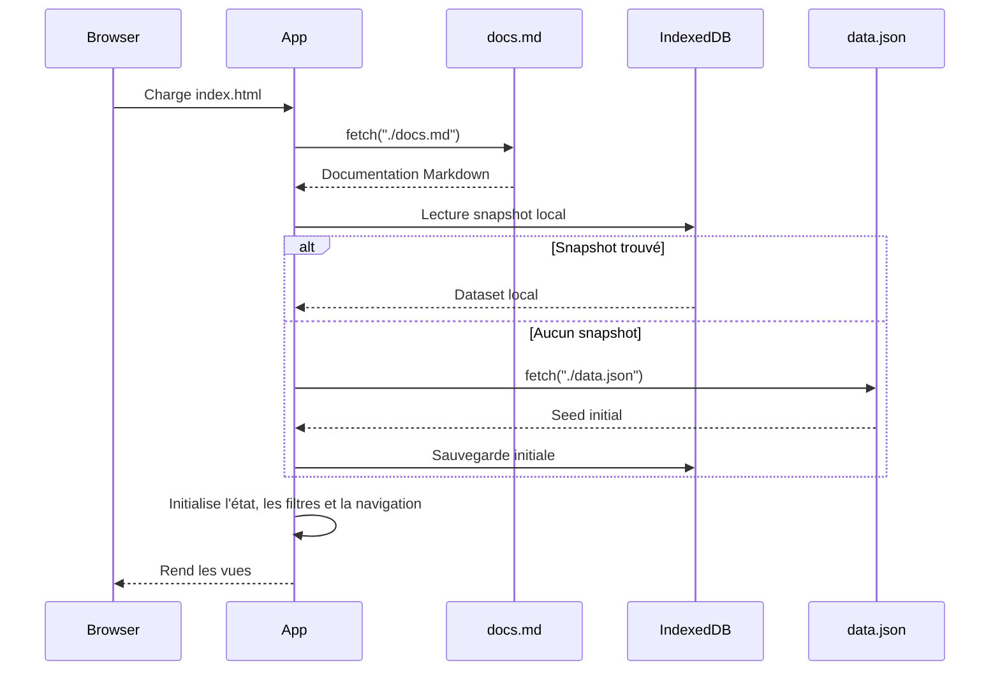
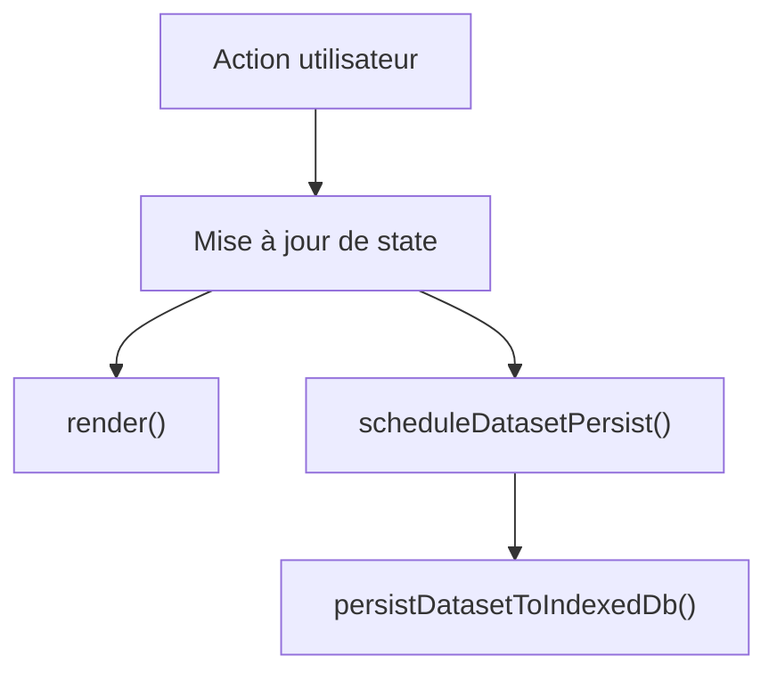

# Documentation de SCORE

## 1. Objectif métier

SCORE est une application de gestion de contrats pour moteurs d'avions, destinée à structurer, consulter et enrichir un référentiel de contrats de services et de support pour les compagnies aériennes et leurs flottes motorisées.

Elle répond à un besoin métier simple :

- sortir d'une logique de consultation exclusivement PDF ;
- consolider les données contractuelles liées aux moteurs d'avions dans un référentiel homogène ;
- rendre les informations utiles plus accessibles aux équipes support, flotte, facturation et gestion de contrats ;
- fournir un socle de données réutilisable par d'autres usages ou outils du SI ;
- administrer les référentiels nécessaires à la qualité de saisie.

Le PDF contractuel reste la source documentaire de référence. SCORE n'a pas vocation à remplacer le document juridique original ; l'application expose une représentation structurée, éditable et filtrable des informations de gestion utiles au pilotage de contrats moteur.

## 2. Périmètre fonctionnel actuel

L'application implémente aujourd'hui quatre espaces principaux :

- `Contrats` : liste des contrats, filtres de recherche, prévisualisation et modal d'édition.
- `Référentiels` : administration locale des listes de valeurs et du référentiel `customers`.
- `Docs` : documentation embarquée, rendue depuis `docs.md`.
- `Console API` : projection JSON simulée du dataset courant.

Fonctionnellement, le produit permet :

- de consulter les contrats sous forme de tableau ;
- de filtrer la liste par référence, contrat, client, type, région et statut de validation ;
- d'ouvrir un contrat en modal et d'éditer ses données de manière compacte ;
- de créer un nouveau contrat depuis l'interface ;
- de modifier les référentiels utilisés dans les listes déroulantes ;
- d'exposer le dataset courant via une console API simulée ;
- de persister les modifications localement dans le navigateur via IndexedDB.

## 3. Navigation et interfaces

## 3.1 Navigation latérale

La sidebar constitue le point d'entrée principal de l'application.

| Entrée | Rôle |
| --- | --- |
| `Contrats` | vue opérationnelle principale |
| `Référentiels` | administration locale des listes et clients |
| `Docs` | documentation fonctionnelle et technique |
| `Console API` | visualisation des endpoints simulés |

## 3.2 Vue `Contrats`

La vue `Contrats` se compose de trois zones :

- un header avec compteur et bouton de création ;
- une table de contrats avec filtres popover dans les en-têtes de colonnes ;
- un panneau droit de prévisualisation.

Le tableau affiche :

- la référence ;
- le nom du contrat et l'équipe gestionnaire ;
- le client ;
- le type ;
- la région ;
- la période ;
- le statut global de validation.

Chaque ligne est sélectionnable au clic ou au clavier.

## 3.3 Panneau de prévisualisation

Le panneau droit affiche la fiche synthétique du contrat sélectionné :

- informations générales ;
- finance ;
- flotte ;
- documents ;
- widgets ;
- extraits PDF simulés.

Le panneau est redimensionnable sur desktop, avec persistance de largeur dans `localStorage`.

## 3.4 Modal contrat

La modal contrat sert à la fois à l'édition et à la création.

Caractéristiques :

- header compact contenant identité du contrat et statut de validation ;
- onglets horizontaux avec icônes Lucide ;
- édition compacte par groupes de champs ;
- formulaires adaptés au type de donnée : `input`, `select`, `textarea`, `date`, `number` ;
- validation de champs obligatoires lors de la création ;
- édition des widgets dans un onglet dédié ;
- consultation des extraits PDF dans un onglet dédié.

## 3.5 Vue `Référentiels`

La vue `Référentiels` expose un onglet horizontal pour :

- `customers` ;
- chaque référentiel racine du dataset hors `contracts`.

L'écran permet :

- d'ajouter une entrée ;
- de modifier une entrée inline ;
- de supprimer une entrée ;
- de faire évoluer immédiatement les listes de choix consommées par la modal contrat.

`customers` est géré comme un tableau structuré avec les colonnes :

- `id` ;
- `name` ;
- `accountCode` ;
- `country`.

Les autres référentiels sont gérés comme des listes simples de chaînes.

## 3.6 Vue `Docs`

L'onglet `Docs` charge `docs.md` puis le convertit en HTML côté client via un parser Markdown embarqué.

Le moteur gère :

- titres ;
- paragraphes ;
- listes ;
- tableaux Markdown ;
- citations ;
- blocs de code ;
- diagrammes Mermaid.

## 3.7 Vue `Console API`

La console API ne fait aucun appel réseau métier. Elle projette l'état courant en mémoire sous forme de payloads JSON simulés.

Endpoints disponibles :

- `GET /api/contracts`
- `GET /api/contracts/:id`
- `GET /api/customers`
- `GET /api/export/data.json`

## 4. Architecture des données

## 4.1 Structure racine du dataset

Le dataset n'est plus structuré autour d'un bloc `lists`. Les référentiels sont directement présents à la racine.

Schéma logique actuel :

| Clé racine | Type | Description |
| --- | --- | --- |
| `customers` | `Customer[]` | référentiel clients |
| `contractTypes` | `string[]` | types de contrat |
| `regions` | `string[]` | zones géographiques |
| `contractStatuses` | `string[]` | statuts métier contrat |
| `validationStatuses` | `string[]` | statuts de validation globaux |
| `currencies` | `string[]` | devises |
| `billingModels` | `string[]` | modèles de facturation |
| `programs` | `string[]` | programmes / flottes |
| `summaryStatuses` | `string[]` | statuts de synthèse IA |
| `managingCompanies` | `string[]` | sociétés de rattachement équipe |
| `widgetStatuses` | `string[]` | statuts de widgets |
| `widgetReadAccesses` | `string[]` | droits de lecture widget |
| `widgetEditAccesses` | `string[]` | droits d'édition widget |
| `contracts` | `Contract[]` | référentiel principal des contrats |

Règle de chargement front :

- `customers` et `contracts` sont traités comme agrégats métier spécifiques ;
- toutes les autres clés racine sont interprétées comme des référentiels éditables.

## 4.2 Vue relationnelle

## 4.3 Objet `Customer`

| Champ | Type | Description |
| --- | --- | --- |
| `id` | `string` | identifiant technique |
| `name` | `string` | nom commercial |
| `accountCode` | `string` | code compte |
| `country` | `string` | pays principal |

## 4.4 Objet `Contract`

| Champ | Type | Description |
| --- | --- | --- |
| `id` | `string` | identifiant unique |
| `name` | `string` | libellé métier |
| `type` | `string` | type de contrat |
| `customerId` | `string` | référence vers `customers.id` |
| `region` | `string` | région métier |
| `status` | `string` | statut métier du contrat |
| `startDate` | `string` | date de début `YYYY-MM-DD` |
| `endDate` | `string` | date de fin `YYYY-MM-DD` |
| `globalValidationStatus` | `string` | statut consolidé de validation |
| `managingTeam` | `ManagingTeam` | équipe de gestion |
| `financials` | `Financials` | bloc finance |
| `fleet` | `Fleet` | bloc flotte |
| `documents` | `Documents` | informations documentaires |
| `widgets` | `Widget[]` | détail métier |
| `pdfSimulation` | `PdfSimulation` | extraits PDF simulés |

## 4.5 Sous-objets

| Objet | Champs principaux | Usage |
| --- | --- | --- |
| `ManagingTeam` | `name`, `contact`, `email`, `phone`, `company` | identification des interlocuteurs |
| `Financials` | `currency`, `billingModel`, `estimatedAnnualValue`, `rateRevision` | bloc finance |
| `Fleet` | `program`, `enginesCovered`, `aircraftCovered`, `base` | bloc flotte |
| `Documents` | `sourcePdf`, `summaryAi`, `importantPages` | bloc documents |
| `Widget` | `id`, `name`, `type`, `status`, `lastStatusChange`, `readAccess`, `editAccess`, `data` | détail contractuel |
| `PdfSimulation` | `title`, `pages` | projection documentaire simulée |

## 4.6 Typologie des widgets

| Type | Structure attendue | Usage UI |
| --- | --- | --- |
| `fields` | objet clé/valeur | édition de champs simples |
| `table` | `{ items: [{ label, value }] }` | saisie verticale de lignes |
| `article` | `{ paragraphs: string[] }` | texte structuré |

## 4.7 Hydratation métier

Les contrats stockent un `customerId`. La vue front hydrate ensuite un objet `customer` complet pour l'affichage.

En cas de référence client manquante, l'application affiche un client de repli :

- `name = "Client inconnu"`
- `accountCode = ""`
- `country = ""`

## 5. Architecture applicative

## 5.1 Principes techniques

L'application est une SPA légère sans framework.

Le cœur de l'application est porté par :

- une structure HTML statique ;
- un fichier CSS global ;
- un script JavaScript embarqué dans `index.html` ;
- un chargement de `docs.md` et `data.json` via `fetch` ;
- un rendu Mermaid via CDN ;
- une persistance métier côté navigateur via IndexedDB.

## 5.2 Fichiers principaux

| Fichier | Rôle |
| --- | --- |
| `index.html` | shell HTML, logique de rendu, événements, persistance |
| `style.css` | styles de l'application |
| `data.json` | seed initial du dataset |
| `docs.md` | documentation affichée dans la vue `Docs` |
| `specs.md` | spécification fonctionnelle de référence projet |

## 5.3 État front principal

Le front centralise son état dans un objet `state`.

Éléments structurants :

| Clé | Rôle |
| --- | --- |
| `customers` | référentiel clients courant |
| `lists` | objet regroupant tous les référentiels racine hors `customers` et `contracts` |
| `contracts` | liste des contrats courants |
| `filteredContracts` | projection filtrée de `contracts` |
| `selectedContractId` | contrat actif |
| `activeView` | vue courante |
| `activeReferentialTab` | référentiel actif dans la page `Référentiels` |
| `contractModalMode` | mode `edit` ou `create` |
| `draftContract` | brouillon de création |
| `contractFormErrors` | erreurs de validation du formulaire de création |
| `columnFilters` | filtres du tableau contrats |

## 5.4 Persistance locale

Deux mécanismes de persistance sont utilisés.

### `IndexedDB`

IndexedDB est la source de vérité locale pour les données métier une fois l'application utilisée.

Base :

- nom : `contratheque-db`
- store : `appState`
- clé : `dataset`

Payload persisté :

- `customers`
- tous les référentiels racine
- `contracts`

Comportement :

1. au démarrage, l'application tente de charger un snapshot depuis IndexedDB ;
2. si aucun snapshot n'existe, elle charge `data.json` ;
3. elle persiste ensuite le dataset courant localement ;
4. chaque modification métier reprogramme une sauvegarde différée.

### `localStorage`

`localStorage` est utilisé uniquement pour la largeur du panneau de prévisualisation via la clé `previewSidebarWidth`.

## 5.5 Flux de chargement

## 5.6 Cycle d'une modification

## 6. Règles fonctionnelles implémentées

| Règle | Comportement actuel |
| --- | --- |
| Filtrage contrat | filtres par référence, contrat, client, type, région, statut |
| Client affiché | hydratation via `customerId` |
| Création contrat | bouton `plus`, brouillon avec valeurs par défaut |
| Validation création | champs obligatoires + contrôle simple des dates |
| Edition contrat | édition inline via modal compacte |
| Référentiels | édition locale de `customers` et des listes racine |
| Console API | expose l'état courant, y compris les modifications locales |
| Documentation | rend `docs.md` dans l'application |
| Persistance locale | via IndexedDB |

## 7. Aspects techniques notables

- Le parser Markdown est fait maison et couvre un sous-ensemble utile de Markdown.
- Les diagrammes Mermaid sont rendus à la volée dans l'onglet `Docs`.
- La console API est purement locale et reflète l'état front courant.
- Les listes déroulantes sont alimentées depuis les référentiels racine.
- Le panneau de preview est redimensionnable avec persistance locale.

## 8. Limites actuelles

- Il n'existe pas de backend ; toute la persistance est locale au navigateur.
- Les modifications IndexedDB masquent les évolutions futures de `data.json` tant qu'aucune réinitialisation n'est faite.
- Les suppressions dans les référentiels ne sont pas sécurisées par des contrôles d'intégrité relationnelle.
- Les droits d'accès décrits dans la spécification ne sont pas implémentés de manière sécurisée.
- Les exports sont simulés dans la console API mais il n'y a pas d'export fichier natif.

## 9. Recommandations d'évolution

1. Ajouter une action explicite de réinitialisation ou d'export du snapshot IndexedDB.
2. Introduire une validation de schéma sur le dataset métier.
3. Empêcher les suppressions de référentiels encore référencés par les contrats.
4. Extraire la logique JavaScript d'`index.html` vers des modules dédiés.
5. Ajouter une vraie API de persistance serveur si le produit sort du mode prototype local.
