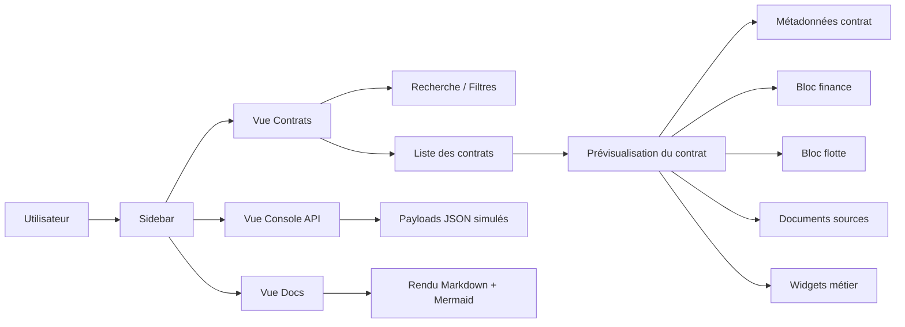
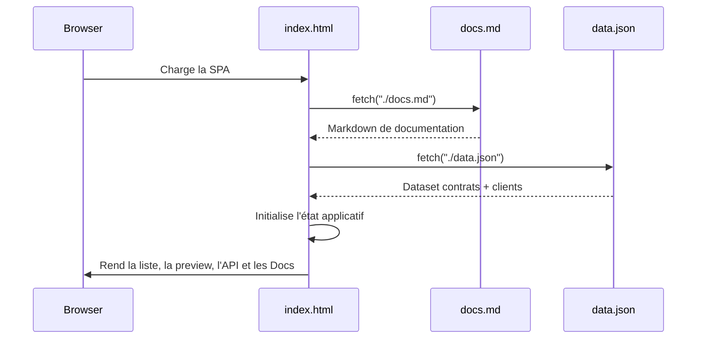
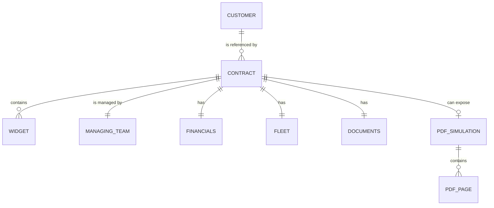
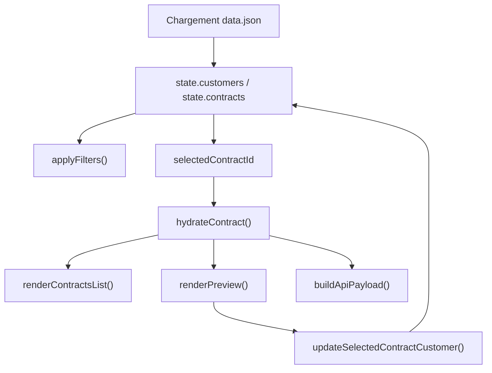

# Documentation de la Contrathèque

## 1. Vue d'ensemble

La Contrathèque est une application web monopage orientée consultation, exploration et exposition des données contractuelles du périmètre civil. Elle centralise un jeu de données structuré issu d'une source `JSON`, propose une vue liste, une vue détaillée par contrat, une console d'API simulée et un espace documentaire.

> Le PDF reste la source documentaire de référence. L'application expose une version structurée, filtrable et réutilisable des informations utiles.

## 2. Objectifs fonctionnels

- Centraliser les informations synthétiques et détaillées des contrats.
- Offrir un point d'entrée unique pour la recherche, la consultation et l'export logique des données.
- Rendre visible la structure métier du contrat : client, équipe gestionnaire, finance, flotte, documents, widgets.
- Simuler une exposition API du référentiel afin de préparer son usage par d'autres applications.
- Documenter l'architecture métier et technique directement depuis l'application via l'onglet `Docs`.

## 3. Modules de l'application

| Module | Rôle | Données manipulées | Actions principales |
| --- | --- | --- | --- |
| `Contrats` | Vue de travail principale | `contracts`, `customers` | Rechercher, filtrer, sélectionner |
| `Prévisualisation` | Fiche détaillée du contrat sélectionné | contrat hydraté + widgets + PDF simulé | Lire, inspecter, mettre à jour le client lié |
| `Console API` | Projection du dataset en endpoints simulés | `contracts`, `customers`, export consolidé | Lire un payload JSON par endpoint |
| `Docs` | Documentation embarquée | `docs.md` | Lire la doc technique/fonctionnelle avec tableaux et Mermaid |

## 4. Parcours utilisateur

1. L'utilisateur ouvre l'application.
2. Le front charge `docs.md` puis `data.json`.
3. La liste des contrats est initialisée avec filtres par texte, statut et type.
4. La sélection d'un contrat hydrate ses données client depuis la table `customers`.
5. La prévisualisation affiche les sections métier et les widgets du contrat.
6. La console API expose des représentations JSON du même référentiel.
7. L'onglet `Docs` affiche la documentation structurée du système.

## 5. Architecture fonctionnelle

## 6. Architecture technique

L'application repose actuellement sur un fichier unique `index.html` qui embarque :

- la structure HTML de l'interface ;
- les styles CSS ;
- la logique JavaScript de rendu et d'interaction ;
- un chargement asynchrone des ressources externes `data.json` et `docs.md` ;
- un rendu Mermaid côté navigateur pour les diagrammes de la documentation.

### 6.1 Composants techniques

| Composant | Responsabilité | Remarques |
| --- | --- | --- |
| `index.html` | Shell applicatif, styles, logique UI | SPA légère sans framework |
| `data.json` | Source des données métier | attend une structure `customers` + `contracts` |
| `docs.md` | Source documentaire affichée dans l'onglet Docs | rendue en HTML dans le navigateur |
| `localStorage` | Persistance locale de la largeur du panneau latéral droit | clé `previewSidebarWidth` |
| `Mermaid` | Rendu des diagrammes d'architecture | chargé via module ESM CDN |
| `Vite` | Serveur de dev / build statique | empaquetage minimal |

### 6.2 Flux de chargement

## 7. Modèle de données

Le dataset attendu est organisé autour de deux agrégats principaux :

- `customers` : référentiel clients ;
- `contracts` : contrats métier qui référencent un client par `customerId`.

### 7.1 Vue relationnelle

### 7.2 Schéma logique du dataset

| Racine | Type | Description |
| --- | --- | --- |
| `customers` | `Customer[]` | table de référence utilisée pour hydrater les contrats |
| `contracts` | `Contract[]` | table principale consommée par l'interface |

### 7.3 Objet `Customer`

| Champ | Type | Description |
| --- | --- | --- |
| `id` | `string` | identifiant technique du client |
| `name` | `string` | nom commercial |
| `accountCode` | `string` | code compte |
| `country` | `string` | pays principal |

### 7.4 Objet `Contract`

| Champ | Type | Description |
| --- | --- | --- |
| `id` | `string` | identifiant unique du contrat |
| `name` | `string` | libellé métier |
| `type` | `string` | typologie contractuelle |
| `status` | `string` | statut global métier |
| `globalValidationStatus` | `string` | statut consolidé de validation |
| `customerId` | `string` | clé étrangère vers `customers.id` |
| `region` | `string` | zone géographique |
| `startDate` | `string` | date de début |
| `endDate` | `string` | date de fin |
| `managingTeam` | `ManagingTeam` | équipe responsable |
| `financials` | `Financials` | données financières |
| `fleet` | `Fleet` | couverture flotte / programme |
| `documents` | `Documents` | liens documentaires |
| `widgets` | `Widget[]` | données métier détaillées |
| `pdfSimulation` | `PdfSimulation?` | extraits simulés des pages PDF |

### 7.5 Sous-objets structurants

| Objet | Champs principaux | Usage UI |
| --- | --- | --- |
| `ManagingTeam` | `name`, `contact`, `email`, `phone`, `company` | encart de gestion et filtres de recherche |
| `Financials` | `estimatedAnnualValue`, `currency`, `billingModel`, `rateRevision` | bloc `Finance` |
| `Fleet` | `program`, `enginesCovered`, `aircraftCovered`, `base` | bloc `Flotte` |
| `Documents` | `sourcePdf`, `summaryAi`, `importantPages` | bloc `Documents` |
| `Widget` | `id`, `name`, `type`, `status`, `lastStatusChange`, `readAccess`, `editAccess`, `data` | cartes de détail |

### 7.6 Typologie des widgets

| `widget.type` | Structure attendue dans `widget.data` | Rendu |
| --- | --- | --- |
| `fields` ou assimilé | objet clé/valeur | liste de paires label / valeur |
| `table` | `{ items: [{ label, value }] }` | tableau simplifié vertical |
| `article` | `{ paragraphs: string[] }` | paragraphes de synthèse |

## 8. Cycle de vie de la donnée dans le front

## 9. Règles fonctionnelles implémentées

| Règle | Comportement actuel |
| --- | --- |
| Filtrage texte | recherche sur identifiant, nom, client, code compte, type, région, équipe |
| Filtrage statut | filtre exact sur `contract.status` |
| Filtrage type | filtre exact sur `contract.type` |
| Sélection | un contrat actif alimente la preview et la console API |
| Hydratation client | les contrats stockent `customerId`, la vue affiche l'objet client complet |
| Mise à jour client | changement local du `customerId` depuis la preview |
| Exposition API | endpoints simulés `contracts`, `contract`, `customers`, `dataset` |
| Documentation | chargée depuis `docs.md`, rendue côté client |

## 10. Endpoints simulés

| Endpoint simulé | Contenu |
| --- | --- |
| `GET /api/contracts` | liste synthétique des contrats |
| `GET /api/contracts/:id` | contrat détaillé sélectionné |
| `GET /api/customers` | table clients |
| `GET /api/export/data.json` | dataset complet |

## 11. États UI et persistance locale

| Élément d'état | Portée | Description |
| --- | --- | --- |
| `state.activeView` | session | vue courante : `contracts`, `docs`, `api` |
| `state.selectedContractId` | session | contrat sélectionné |
| `state.apiEndpoint` | session | endpoint affiché dans la console |
| `state.filteredContracts` | session | projection filtrée de la table contrats |
| `previewSidebarWidth` | navigateur | largeur du panneau droit sauvegardée |

## 12. Limites actuelles et extensions naturelles

- L'application reste 100 % front et ne persiste pas les modifications côté serveur.
- `data.json` est une source statique ; aucun backend réel n'est branché.
- Le parser Markdown embarqué couvre le besoin courant mais pas l'intégralité de la spécification Markdown.
- Les droits d'accès décrits dans les spécifications ne sont pas encore implémentés de manière sécurisée.
- Les exports sont simulés via la console API et non via des fichiers téléchargés.

## 13. Cible d'évolution recommandée

1. Isoler le code JavaScript dans un module dédié.
2. Formaliser le schéma `data.json` avec validation de structure.
3. Introduire un backend de lecture/écriture et une vraie persistance.
4. Ajouter une couche de droits et de confidentialité par widget.
5. Connecter les documents sources, résumés IA et pages importantes à un stockage documentaire réel.
