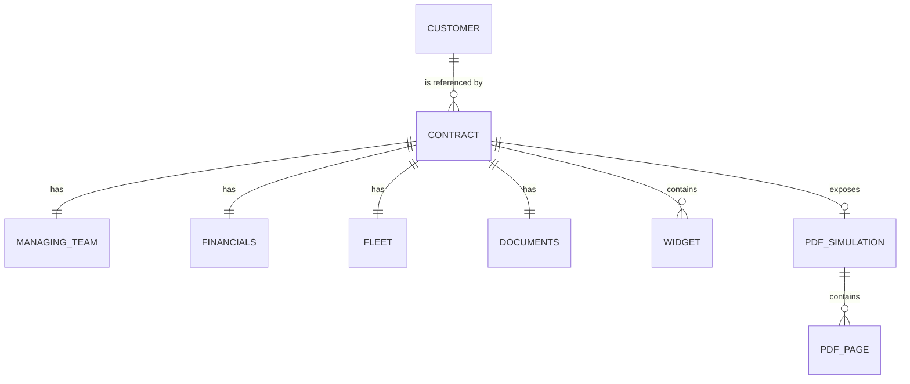
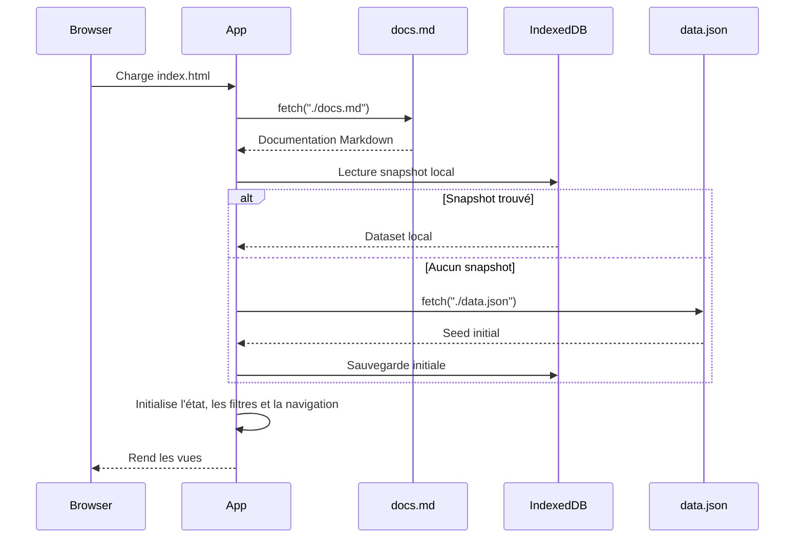
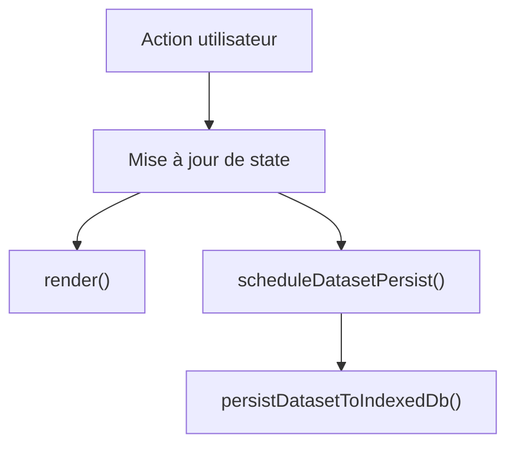

# Documentation de SCORE

## 1. Objectif métier

SCORE est une application de gestion de contrats pour moteurs d'avions, destinée à structurer, consulter et enrichir un référentiel de contrats de services et de support pour les compagnies aériennes et leurs flottes motorisées.

Elle répond à un besoin métier simple :

- sortir d'une logique de consultation exclusivement PDF ;
- consolider les données contractuelles liées aux moteurs d'avions dans un référentiel homogène ;
- rendre les informations utiles plus accessibles aux équipes support, flotte, facturation et gestion de contrats ;
- fournir un socle de données réutilisable par d'autres usages ou outils du SI ;
- administrer les référentiels nécessaires à la qualité de saisie.

Le PDF contractuel reste la source documentaire de référence. SCORE n'a pas vocation à remplacer le document juridique original ; l'application expose une représentation structurée, éditable et filtrable des informations de gestion utiles au pilotage de contrats moteur.

## 1.1 Utilisateurs cibles

Les utilisateurs visés par SCORE sont principalement :

- les équipes de gestion de contrats, qui consultent, créent et mettent à jour les données structurées ;
- les équipes facturation, qui recherchent les informations tarifaires et contractuelles utiles au traitement opérationnel ;
- les équipes flotte et support, qui consultent les données de couverture moteurs et programmes ;
- les équipes relation client, qui recherchent les contacts de gestion et les informations contractuelles clés ;
- d'autres applications du SI, qui peuvent consommer le dataset structuré via la Console API locale.

## 1.2 Capacités métier attendues

Le produit vise à couvrir les besoins suivants :

- centraliser les informations synthétisées des contrats ;
- faciliter la recherche, la consultation et le partage de données contractuelles ;
- identifier rapidement les équipes gestionnaires et les contacts associés ;
- exposer des synthèses documentaires et des extraits issus des PDF contractuels ;
- administrer les référentiels utilisés pour normaliser la saisie ;
- fournir un socle de données réutilisable par d'autres écrans, outils ou exports.

## 2. Périmètre fonctionnel actuel

L'application implémente aujourd'hui quatre espaces principaux :

- `Contrats` : liste des contrats, filtres de recherche et modal de création/édition.
- `Référentiels` : administration locale des listes de valeurs et du référentiel `customers`.
- `Docs` : documentation embarquée, rendue depuis `docs.md`.
- `Console API` : exploration et mutation locales du dataset persisté en IndexedDB.

Fonctionnellement, le produit permet :

- de consulter les contrats sous forme de tableau ;
- de filtrer la liste par référence, contrat, client, type, région et statut de validation ;
- d'ouvrir un contrat en modal et d'éditer ses données de manière compacte ;
- de créer un nouveau contrat depuis l'interface ;
- de modifier les référentiels utilisés dans les listes déroulantes ;
- d'exposer et modifier le dataset courant via une console API locale ;
- de persister les modifications localement dans le navigateur via IndexedDB.

## 2.1 Hors périmètre actuel

Le prototype ne couvre pas :

- la rédaction, la validation juridique ou la signature des contrats ;
- le remplacement du PDF source comme référence documentaire ;
- un backend serveur ou une API distante ;
- une gestion sécurisée des rôles et habilitations ;
- les imports et exports de masse au format bureautique ;
- les parcours d'administration avancés décrits dans la vision cible du produit.

## 3. Navigation et interfaces

## 3.1 Navigation latérale

La sidebar constitue le point d'entrée principal de l'application.

| Entrée | Rôle |
| --- | --- |
| `Contrats` | vue opérationnelle principale |
| `Référentiels` | administration locale des listes et clients |
| `Docs` | documentation fonctionnelle et technique |
| `Console API` | exploration et mutation locale du dataset via routes JSON |

## 3.2 Vue `Contrats`

La vue `Contrats` se compose de deux zones :

- un header avec compteur et bouton de création ;
- une table de contrats avec filtres popover dans les en-têtes de colonnes.

Le tableau affiche :

- la référence ;
- le nom du contrat et l'équipe gestionnaire ;
- le client ;
- le type ;
- la région ;
- la période ;
- le statut global de validation.

Chaque ligne est sélectionnable au clic ou au clavier.

## 3.3 Modal contrat

La modal contrat sert à la fois à l'édition et à la création.

Caractéristiques :

- header compact contenant identité du contrat et statut de validation ;
- onglets horizontaux avec icônes Lucide ;
- édition compacte par groupes de champs ;
- formulaires adaptés au type de donnée : `input`, `select`, `textarea`, `date`, `number` ;
- validation de champs obligatoires en création comme en édition ;
- rangée d'actions homogène avec `Supprimer` en édition, puis `Annuler` et `Créer` ou `Sauvegarder` ;
- édition des widgets dans un onglet dédié ;
- consultation des extraits PDF dans un onglet dédié.

## 3.4 Vue `Référentiels`

La vue `Référentiels` expose un onglet horizontal pour :

- `customers` ;
- chaque référentiel racine du dataset hors `contracts`.

L'écran permet :

- d'ajouter une entrée ;
- de modifier une entrée inline ;
- de supprimer une entrée ;
- de faire évoluer immédiatement les listes de choix consommées par la modal contrat.

`customers` est géré comme un tableau structuré avec les colonnes :

- `id` ;
- `name` ;
- `accountCode` ;
- `country`.

Les autres référentiels sont gérés comme des listes simples de chaînes.

## 3.5 Vue `Docs`

L'onglet `Docs` charge `docs.md` puis le convertit en HTML côté client via un parser Markdown embarqué.

Le moteur gère :

- titres ;
- paragraphes ;
- listes ;
- tableaux Markdown ;
- citations ;
- blocs de code ;
- diagrammes Mermaid.

## 3.6 Vue `Console API`

La Console API ne fait aucun appel réseau distant, mais elle réalise de vraies opérations locales sur le dataset persisté en IndexedDB.

La page se présente sous forme de deux colonnes redimensionnables :

- un panneau `Request` avec sélecteur de route, définition de requête, corps JSON éditable et action `Send` ;
- un panneau `Response` avec définition de réponse et payload JSON renvoyé.

Les blocs de définition de requête et de réponse sont repliés par défaut.

Endpoints disponibles :

- `GET /api/contracts`
- `GET /api/contracts/:id`
- `POST /api/contracts`
- `PUT /api/contracts/:id`
- `GET /api/customers`
- `POST /api/customers`
- `PUT /api/customers/:id`
- `GET /api/<referential>`
- `PUT /api/<referential>`
- `GET /api/export/data.json`

## 3.7 Parcours utilisateur principaux

Les parcours actuellement couverts dans l'application sont :

- rechercher un contrat dans la table puis ouvrir sa modal ;
- créer un contrat en renseignant les champs obligatoires et les référentiels ;
- modifier un contrat existant puis sauvegarder explicitement le brouillon ;
- supprimer un contrat depuis la modal d'édition ;
- administrer les référentiels et clients utilisés par les formulaires ;
- inspecter ou modifier le dataset depuis la Console API locale.

## 4. Architecture des données

## 4.1 Structure racine du dataset

Le dataset n'est plus structuré autour d'un bloc `lists`. Les référentiels sont directement présents à la racine.

Schéma logique actuel :

| Clé racine | Type | Description |
| --- | --- | --- |
| `customers` | `Customer[]` | référentiel clients |
| `contractTypes` | `string[]` | types de contrat |
| `regions` | `string[]` | zones géographiques |
| `contractStatuses` | `string[]` | statuts métier contrat |
| `validationStatuses` | `string[]` | statuts de validation globaux |
| `currencies` | `string[]` | devises |
| `billingModels` | `string[]` | modèles de facturation |
| `programs` | `string[]` | programmes / flottes |
| `summaryStatuses` | `string[]` | statuts de synthèse IA |
| `managingCompanies` | `string[]` | sociétés de rattachement équipe |
| `widgetStatuses` | `string[]` | statuts de widgets |
| `widgetReadAccesses` | `string[]` | droits de lecture widget |
| `widgetEditAccesses` | `string[]` | droits d'édition widget |
| `contracts` | `Contract[]` | référentiel principal des contrats |

Règle de chargement front :

- `customers` et `contracts` sont traités comme agrégats métier spécifiques ;
- toutes les autres clés racine sont interprétées comme des référentiels éditables.

## 4.2 Vue relationnelle

## 4.3 Objet `Customer`

Définition alignée sur la Console API :

| Champ | Type | Description |
| --- | --- | --- |
| `id` | `string` | identifiant client unique |
| `name` | `string` | nom commercial du client |
| `accountCode` | `string` | code compte utilisé par l'organisation |
| `country` | `string` | pays principal du client |

`Customer` est l'objet de référence utilisé :

- pour hydrater les contrats à l'affichage ;
- pour alimenter les listes de sélection de client ;
- pour exposer le référentiel client dans la Console API ;
- pour supporter les opérations locales de création et de mise à jour.

## 4.4 Objet `Contract`

Définition alignée sur la Console API :

| Champ | Type | Description |
| --- | --- | --- |
| `id` | `string` | identifiant contrat unique |
| `name` | `string` | libellé métier du contrat |
| `type` | `enum` | valeur du référentiel de type de contrat |
| `customerId` | `string` | clé étrangère vers `customers.id` |
| `region` | `enum` | région opérationnelle du contrat |
| `status` | `enum` | statut métier du contrat |
| `startDate` | `date` | date de début du contrat au format `YYYY-MM-DD` |
| `endDate` | `date` | date de fin du contrat au format `YYYY-MM-DD` |
| `globalValidationStatus` | `enum` | statut global de validation |
| `managingTeam` | `object` | équipe de gestion et contacts associés |
| `financials` | `object` | bloc de données financières |
| `fleet` | `object` | couverture flotte et moteurs |
| `documents` | `object` | métadonnées documentaires et synthèse IA |
| `widgets` | `array` | widgets métier du contrat |
| `pdfSimulation` | `object` | extraits simulés du PDF source |

Deux niveaux de représentation existent dans l'application :

- `Contract summary` : projection synthétique utilisée dans `GET /api/contracts` et dans la liste ;
- `Contract` complet : objet détaillé utilisé dans `GET /api/contracts/:id`, la modal et les opérations d'édition.

### 4.4.1 Projection `Contract summary`

La projection synthétique expose uniquement les champs utilisés pour le listing et pour les réponses légères de la Console API.

| Champ | Type | Description |
| --- | --- | --- |
| `id` | `string` | identifiant contrat unique |
| `name` | `string` | libellé métier du contrat |
| `type` | `enum` | type de contrat |
| `status` | `enum` | statut métier courant |
| `globalValidationStatus` | `enum` | statut global de validation |
| `customer` | `object` | objet client hydraté |
| `region` | `enum` | région d'exploitation |
| `startDate` | `date` | date de début |
| `endDate` | `date` | date de fin |

## 4.5 Sous-objets

| Objet | Champs principaux | Usage |
| --- | --- | --- |
| `ManagingTeam` | `name`, `contact`, `email`, `phone`, `company` | équipe de gestion et interlocuteurs du contrat |
| `Financials` | `currency`, `billingModel`, `estimatedAnnualValue`, `rateRevision` | bloc de données financières |
| `Fleet` | `program`, `enginesCovered`, `aircraftCovered`, `base` | couverture flotte, moteurs et base de rattachement |
| `Documents` | `sourcePdf`, `summaryAi`, `importantPages` | source PDF, synthèse IA et pages marquantes |
| `Widget` | `id`, `name`, `type`, `status`, `lastStatusChange`, `readAccess`, `editAccess`, `data` | unité détaillée d'information contractuelle |
| `PdfSimulation` | `title`, `pages` | projection simulée des extraits du PDF source |

### 4.5.1 Objet `ManagingTeam`

| Champ | Type | Description |
| --- | --- | --- |
| `name` | `string` | nom de l'équipe de gestion |
| `contact` | `string` | nom de l'interlocuteur principal |
| `email` | `string` | adresse e-mail de contact |
| `phone` | `string` | numéro de téléphone |
| `company` | `string` | société de rattachement |

### 4.5.2 Objet `Financials`

| Champ | Type | Description |
| --- | --- | --- |
| `currency` | `enum` | devise de référence |
| `billingModel` | `enum` | modèle de facturation |
| `estimatedAnnualValue` | `number` | valeur annuelle estimée |
| `rateRevision` | `string` | règle de révision tarifaire |

### 4.5.3 Objet `Fleet`

| Champ | Type | Description |
| --- | --- | --- |
| `program` | `enum` | programme ou flotte couverte |
| `enginesCovered` | `number` | nombre de moteurs couverts |
| `aircraftCovered` | `number` | nombre d'avions couverts |
| `base` | `string` | base opérationnelle principale |

### 4.5.4 Objet `Documents`

| Champ | Type | Description |
| --- | --- | --- |
| `sourcePdf` | `string` | nom ou référence du PDF source |
| `summaryAi` | `enum` | statut ou disponibilité de la synthèse IA |
| `importantPages` | `number[]` | pages principales identifiées dans le document |

### 4.5.5 Objet `Widget`

| Champ | Type | Description |
| --- | --- | --- |
| `id` | `string` | identifiant widget unique |
| `name` | `string` | libellé métier du widget |
| `type` | `string` | type de widget (`fields`, `table`, `article`) |
| `status` | `enum` | statut du widget |
| `lastStatusChange` | `date` | date du dernier changement de statut |
| `readAccess` | `enum` | niveau de lecture autorisé |
| `editAccess` | `enum` | niveau d'édition autorisé |
| `data` | `object` | contenu métier du widget |

### 4.5.6 Objet `PdfSimulation`

| Champ | Type | Description |
| --- | --- | --- |
| `title` | `string` | titre de la projection documentaire |
| `pages` | `array` | extraits de pages simulées |

## 4.6 Typologie des widgets

| Type | Structure attendue | Usage UI |
| --- | --- | --- |
| `fields` | objet clé/valeur | édition de champs simples |
| `table` | `{ items: [{ label, value }] }` | saisie verticale de lignes |
| `article` | `{ paragraphs: string[] }` | texte structuré |

## 4.7 Objet `Referential`

La Console API manipule chaque référentiel racine comme une ressource de premier niveau.

Définition alignée sur la Console API :

| Champ | Type | Description |
| --- | --- | --- |
| `key` | `string` | nom technique du référentiel racine |
| `values[]` | `string` | valeur autorisée dans la liste du référentiel |

Un référentiel est utilisé pour :

- alimenter les listes déroulantes ;
- normaliser les valeurs de saisie ;
- supporter les routes `GET /api/<referential>` et `PUT /api/<referential>` ;
- piloter les choix disponibles dans la modal contrat et la page `Référentiels`.

## 4.8 Hydratation métier

Les contrats stockent un `customerId`. La vue front hydrate ensuite un objet `customer` complet pour l'affichage.

En cas de référence client manquante, l'application affiche un client de repli :

- `name = "Client inconnu"`
- `accountCode = ""`
- `country = ""`

## 5. Architecture applicative

## 5.1 Principes techniques

L'application est une SPA légère sans framework.

Le cœur de l'application est porté par :

- une structure HTML statique ;
- un fichier CSS global ;
- un script JavaScript embarqué dans `index.html` ;
- un chargement de `docs.md` et `data.json` via `fetch` ;
- un rendu Mermaid via CDN ;
- une persistance métier côté navigateur via IndexedDB.

## 5.2 Fichiers principaux

| Fichier | Rôle |
| --- | --- |
| `index.html` | shell HTML, logique de rendu, événements, persistance |
| `style.css` | styles de l'application |
| `data.json` | seed initial du dataset |
| `docs.md` | documentation affichée dans la vue `Docs` |

## 5.3 État front principal

Le front centralise son état dans un objet `state`.

Éléments structurants :

| Clé | Rôle |
| --- | --- |
| `customers` | référentiel clients courant |
| `referentials` | objet regroupant tous les référentiels racine hors `customers` et `contracts` |
| `contracts` | liste des contrats courants |
| `filteredContracts` | projection filtrée de `contracts` |
| `selectedContractId` | contrat actif |
| `activeView` | vue courante |
| `activeReferentialTab` | référentiel actif dans la page `Référentiels` |
| `contractModalMode` | mode `edit` ou `create` |
| `draftContract` | brouillon courant de création ou d'édition |
| `contractFormErrors` | erreurs de validation du formulaire contrat |
| `columnFilters` | filtres du tableau contrats |
| `apiRoute` | route active dans la Console API |
| `apiRequestBody` | corps JSON éditable de la requête API locale |

## 5.4 Persistance locale

Deux mécanismes de persistance sont utilisés.

### `IndexedDB`

IndexedDB est la source de vérité locale pour les données métier une fois l'application utilisée.

Base :

- nom : `contratheque-db`
- store : `appState`
- clé : `dataset`

Payload persisté :

- `customers`
- tous les référentiels racine
- `contracts`

Comportement :

1. au démarrage, l'application tente de charger un snapshot depuis IndexedDB ;
2. si aucun snapshot n'existe, elle charge `data.json` ;
3. elle persiste ensuite le dataset courant localement ;
4. chaque modification métier reprogramme une sauvegarde différée.

### `localStorage`

`localStorage` est utilisé pour les préférences purement UI, notamment la largeur relative des colonnes de la Console API via la clé `apiConsoleResponseWidth`.

## 5.5 Flux de chargement

## 5.6 Cycle d'une modification

## 6. Règles fonctionnelles implémentées

| Règle | Comportement actuel |
| --- | --- |
| Filtrage contrat | filtres par référence, contrat, client, type, région, statut |
| Client affiché | hydratation via `customerId` |
| Création contrat | bouton `plus`, brouillon avec valeurs par défaut |
| Validation formulaire contrat | champs obligatoires + contrôle simple des dates en création et édition |
| Edition contrat | brouillon modal avec sauvegarde explicite |
| Suppression contrat | action dédiée depuis le footer de la modal d'édition |
| Référentiels | édition locale de `customers` et des listes racine |
| Console API | lit et modifie réellement l'état courant en IndexedDB |
| Documentation | rend `docs.md` dans l'application |
| Persistance locale | via IndexedDB |

## 7. Aspects techniques notables

- Le parser Markdown est fait maison et couvre un sous-ensemble utile de Markdown.
- Les diagrammes Mermaid sont rendus à la volée dans l'onglet `Docs`.
- La console API est purement locale, sans backend distant, et reflète le snapshot IndexedDB courant.
- Les listes déroulantes sont alimentées depuis les référentiels racine.
- Les colonnes `Request` et `Response` de la Console API sont redimensionnables avec persistance locale.

## 8. Limites actuelles

- Il n'existe pas de backend ; toute la persistance est locale au navigateur.
- Les modifications IndexedDB masquent les évolutions futures de `data.json` tant qu'aucune réinitialisation n'est faite.
- Les suppressions dans les référentiels ne sont pas sécurisées par des contrôles d'intégrité relationnelle.
- Les droits d'accès décrits dans la spécification ne sont pas implémentés de manière sécurisée.
- Les exports sont exposés sous forme JSON dans la Console API mais il n'y a pas d'export fichier natif.

## 9. Recommandations d'évolution

1. Ajouter une action explicite de réinitialisation ou d'export du snapshot IndexedDB.
2. Introduire une validation de schéma sur le dataset métier.
3. Empêcher les suppressions de référentiels encore référencés par les contrats.
4. Extraire la logique JavaScript d'`index.html` vers des modules dédiés.
5. Ajouter une vraie API de persistance serveur si le produit sort du mode prototype local.
