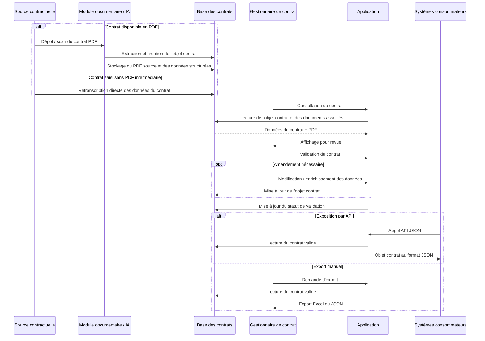

# Spécification fonctionnelle de l'application

## 1. Objectif

### 1.1 Contexte
- L'application sert de référentiel digital pour les contrats de services et de support du périmètre civil.
- Elle centralise des données contractuelles synthétisées.
- Elle rend l'information plus fiable, plus accessible et plus facile à partager.
- Elle permet à plusieurs applications et équipes d'exploiter la même base de données.

### 1.2 Problématique à résoudre
- Les données contractuelles sont aujourd'hui surtout disponibles en PDF.
- Ces données sont peu structurées et peu digitalisées.
- Le suivi des contrats est hétérogène.
- Chaque acteur utilise souvent ses propres fichiers Excel.
- Il manque une vision globale des contrats en gestion.
- Les rôles et responsabilités sont difficiles à identifier.
- Le partage d'information repose encore trop sur les e-mails et les fichiers bureautiques.
- Cela réduit la fiabilité, la traçabilité et l'accessibilité des données.

### 1.3 Utilisateurs cibles
- Les équipes de facturation consultent les taux et les données utiles au traitement opérationnel.
- Les gestionnaires de contrats consultent les données et contribuent à leur validation.
- Les équipes client consultent les informations clés et les contacts de gestion.
- Les équipes flotte recherchent les informations essentielles liées aux contrats.
- D'autres applications du SI consomment les données du référentiel.
- Les usages externes incluent notamment la facturation moteur, les shop visits et le suivi qualité.

### 1.4 Objectifs fonctionnels
- Centraliser les informations synthétisées des contrats.
- Rechercher et consulter les contrats selon des critères métier.
- Donner une vue synthétique des données contractuelles.
- Identifier les équipes gestionnaires.
- Faciliter le partage des données entre utilisateurs et applications.
- Mettre à disposition des résumés de contrats et des pages importantes via l'IA.
- Fournir des tableaux de bord pour le pilotage.
- Permettre des requêtes personnalisées via un query builder.
- Exporter les données dans un format exploitable, notamment Excel.

Besoins d'administration :
- Administrer les flottes, les utilisateurs et les équipes.
- Mettre à jour en masse les customer teams.
- Configurer l'affichage des types de contrats.
- Gérer les résumés IA et les pages importantes.
- Mettre à jour en masse certains statuts fonctionnels.
- Gérer la confidentialité des widgets et les droits associés.
- Suivre les usages du référentiel.
- Administrer les référentiels de données.
- Gérer les tooltips.
- Réaliser des imports et exports de masse via Excel.
- Assurer un suivi minimal des utilisateurs et des contrats.

### 1.5 Périmètre
- Le périmètre initial couvre les contrats de services et de support du périmètre civil.
- Le premier lot vise environ une trentaine de contrats.
- Les contrats inclus sont notamment les T&M, RPFH, GTA et licenses.
- L'application couvre en priorité la consultation, la recherche, la synthèse, le partage et le pilotage.
- Elle inclut aussi les fonctions d'administration du référentiel.
- À moyen terme, le périmètre pourra être étendu à d'autres contrats, notamment les MSA.

### 1.6 Hors périmètre
- L'application ne remplace pas le PDF contractuel source.
- Le PDF reste la référence documentaire.
- L'application ne couvre pas la rédaction des contrats.
- Elle ne couvre pas la validation juridique.
- Elle ne couvre pas la signature contractuelle.
- Elle ne remplace pas les outils opérationnels de facturation.
- Tous les types de contrats et de documents ne sont pas inclus au départ.
- Certains documents hors périmètre peuvent être synthétisés sans être intégrés au même niveau.

## 2. Interface

### 2.1 Principes généraux d'interface
- L'application utilise une navigation latérale.
- Chaque onglet ouvre un module dans la zone principale.
- L'interface doit rester simple et lisible.
- Les principaux espaces sont : Home, Dashboard, Contracts, Current Contract, Query Builder, Documentation et Administration.
- Le module Contracts présente les contrats sous forme de tableau.
- Chaque ligne correspond à un contrat.
- Les colonnes affichent les informations synthétiques principales.
- La vue détaillée d'un contrat est organisée en widgets.
- Chaque widget affiche une information contractuelle spécifique.
- Selon les droits, l'utilisateur peut consulter, éditer, valider ou exporter les données.

Principes à respecter :
- Simplicité d'utilisation.
- Lisibilité des informations.
- Séparation claire entre métier et administration.
- Accès rapide à la recherche, à la consultation et à l'export.
- Structuration cohérente des écrans.

### 2.2 Parcours utilisateur principaux
- Parcours 1 : rechercher un contrat, l'identifier dans la liste, puis l'ouvrir.
- Parcours 2 : consulter un contrat, compléter ou modifier ses widgets selon les droits.
- Parcours 3 : exporter tout ou partie des données d'un contrat.
- Parcours 4 : vérifier un widget et faire évoluer son statut de validation.
- Parcours 5 : construire une requête dans le query builder puis consulter ou exporter le résultat.
- Parcours 6 : administrer les paramètres, les layouts, les référentiels et les mises à jour de masse.

### 2.3 Écrans principaux
Utilisateurs non administrateurs :
- Home : diffuser des actualités et des informations de service.
- Dashboard : suivre les contrats, leur état d'avancement et leurs échéances.
- Contracts : rechercher, filtrer, consulter et exporter les contrats.
- Current Contract : consulter le détail d'un contrat via des widgets.
- Query Builder : construire des requêtes personnalisées et exporter les résultats.
- Documentation : accéder à la documentation et au showroom de l'application.

Écrans d'administration :
- Administration des flottes et des utilisateurs.
- Gestion des layouts.
- Gestion des résumés IA et des pages importantes.
- Gestion des customer teams.
- Gestion des statuts de validation.
- Gestion de la confidentialité des widgets.
- Gestion des droits d'accès.
- Suivi des usages.
- Gestion des référentiels.
- Gestion de la contrathèque.
- Gestion des articles synthétisés manuellement.
- Gestion des tooltips.
- Imports de masse.
- Suivi simplifié des utilisateurs et des contrats.
- Le module Articles gère les articles synthétisés manuellement.

### 2.4 Règles d'interaction et de validation
- Les données détaillées sont structurées en widgets.
- Les champs peuvent être libres, datés, liés à des référentiels ou composés d'articles structurés.
- Les administrateurs et les gestionnaires de contrats peuvent modifier les données.
- Les autres utilisateurs ont des droits limités selon leur profil.

Statuts possibles des widgets :
- Initial.
- Draft.
- Ready for validation.
- Valid.
- Non applicable.
- Pending for external data.

Droits d'accès :
- Lecture sans données financières.
- Lecture avec données financières.
- Lecture et édition.
- Administration.

Règles complémentaires :
- Les droits peuvent dépendre de l'utilisateur, du type de contrat, du widget ou de la nature des données.
- Les utilisateurs autorisés peuvent exporter les données à tout moment.
- Les formats d'export attendus incluent JSON et Excel.
- La création de contrats est réservée aux administrateurs.

## 3. Données

### 3.1 Objets métier principaux
- Contrat : objet central du référentiel.
- Type de contrat : catégorie métier qui détermine les règles applicables.
- Widget : bloc d'information dans la vue détaillée d'un contrat.
- Statut de validation : état d'avancement ou de validation d'un widget.
- Utilisateur : personne accédant à l'application.
- Droits / profils d'accès : règles d'habilitation.
- Customer team / équipe gestionnaire : équipe responsable ou contact d'un contrat.
- Flotte : objet de rattachement pour le pilotage ou l'administration.
- Référentiels de données : listes normalisées utilisées dans l'application.
- Article : contenu textuel synthétisé et structuré.
- Layout : organisation des widgets par type de contrat.
- Usage / tracking : données de suivi de l'activité.

Sources documentaires associées :
- Les PDF, résumés IA et pages sources viennent d'un module externe.
- Les PDF sont analysés par IA.
- Les résumés sont stockés sur AWS S3.
- Ces contenus sont consommés par l'application.
- Ils ne sont pas tous gérés nativement dans le périmètre principal.

### 3.2 Données par objet
#### Contrat
Le contrat est l'objet principal du référentiel.

| Clé | Définition | Format | Liste d'exemples |
| --- | --- | --- | --- |
| `contractName` | Nom usuel du contrat. | Texte | `GE90 Support 2025`, `Trent XWB Services Agreement` |
| `contractId` | Identifiant unique du contrat dans l'application. | Texte structuré | `CTR-000245`, `RPFH-AF-2024-01` |
| `contractType` | Type de contrat utilisé pour déterminer les règles métier et le layout. | Enum / référentiel | `T&M`, `RPFH`, `GTA`, `License` |
| `customer` | Client ou compagnie aérienne liée au contrat. | Texte / référence | `Air France`, `Lufthansa`, `Emirates` |
| `region` | Région de rattachement du contrat. | Enum / référentiel | `Europe`, `Middle East`, `Asia-Pacific` |
| `startDate` | Date de début d'application du contrat. | Date `YYYY-MM-DD` | `2025-01-01`, `2024-07-15` |
| `endDate` | Date de fin d'application du contrat. | Date `YYYY-MM-DD` | `2027-12-31`, `2026-06-30` |
| `customerTeam` | Équipe gestionnaire responsable du suivi du contrat. | Texte / référence | `Customer Team France`, `Civil Support EMEA` |
| `globalStatus` | Statut global de suivi du contrat dans l'application. | Enum | `Draft`, `Active`, `Expired`, `Closed` |
| `financialData` | Ensemble des données financières associées au contrat. | Objet structuré | `billingRates`, `currency`, `minimumCommitment`, `escalationClauses` |
| `fleetData` | Ensemble des données de flotte rattachées au contrat. | Objet structuré / liste | `engineTypes`, `aircraftTypes`, `fleetSize`, `coveredUnits` |
| `documents` | Documents associés au contrat et consultables depuis l'application. | Liste d'objets documentaires | `PDF contractuel`, `résumé IA`, `pages importantes`, `annexes` |
| `businessSpecificData` | Données métier spécifiques présentes uniquement pour certains types de contrats. | Objet optionnel | `shop visit terms`, `rate tables`, `license scope`, `performance clauses` |
| `layout` | Configuration d'affichage appliquée au contrat selon son type. | Référence / configuration | `layout_T&M_standard`, `layout_RPFH_v2` |

Règles complémentaires :
- Certains contrats contiennent des données métier spécifiques en plus du socle commun.
- Les données affichées varient selon le type de contrat et le layout associé.

#### Widget
- Le widget est l'unité de présentation et de gestion des données.
- Certains widgets ont un périmètre d'applicabilité.
- D'autres permettent l'édition directe de la donnée.
- Un widget peut être de type tableau, champs/listes ou article.
- Les widgets de type article utilisent des structures avec listes de valeurs.

Principales données du widget :
- le nom ;
- la version ;
- le rattachement à un ou plusieurs types de contrats ;
- la donnée portée ;
- le périmètre d'applicabilité ;
- le statut ;
- la date de dernière modification de statut ;
- l'historique des modifications ;
- les droits de lecture et d'édition ;
- les liens vers le PDF source ou le résumé associé.

Fonctions disponibles :
- Visualiser la donnée.
- Modifier le contenu selon les droits.
- Changer le statut.
- Afficher le PDF à proximité.
- Consulter le résumé associé.
- Accéder à l'historique des modifications.

Administration associée :
- Le layout gère le nom et la version du widget.
- Les menus de confidentialité et de droits pilotent les accès.

#### Customer team / équipe gestionnaire
- L'équipe gestionnaire identifie les interlocuteurs d'un contrat.
- Les données principales sont le nom, l'entreprise, le poste, l'e-mail et le téléphone.
- Cet objet sert surtout à retrouver rapidement les bons contacts.

#### Référentiels de données
- L'application utilise plus de 70 référentiels.
- Ils servent à normaliser les valeurs et à fiabiliser la saisie.
- Ils alimentent les listes de sélection et structurent les données.

Principales familles :
- Parts.
- Unités.
- Compagnies aériennes.
- Aéroports.
- Types de contrats.
- Clients.
- Pays.
- Régions.
- Listes de valeurs pour les articles et widgets.

### 3.3 Règles de gestion
- Chaque contrat est rattaché à un type de contrat.
- Le type de contrat détermine le layout.
- Chaque widget doit avoir un statut.
- Un widget peut être non applicable.
- La visibilité de certains widgets dépend des droits.
- L'accès aux données financières est restreint.
- Les articles peuvent utiliser des listes partagées ou spécifiques.
- Les droits de lecture, d'édition et d'administration varient selon les profils.
- Les données affichées varient selon le type de contrat, le layout et les droits.

### 3.4 Droits d'accès et visibilité
Profils principaux :
- Lecteur sans données financières.
- Lecteur avec données financières.
- Lecteur + édition.
- Administrateur général.
- Administrateur limité à certains widgets.

Niveaux d'application des droits :
- Niveau global de l'application.
- Niveau type de contrat.
- Niveau widget.
- Niveau catégorie de données.

Objectifs :
- Maîtriser la confidentialité.
- Sécuriser les modifications.
- Adapter les usages aux responsabilités réelles.

### 3.5 Flux de données
- La source principale est le PDF contractuel.
- Les PDF alimentent l'application via un module documentaire et IA.
- Ce module extrait des résumés et des pages pertinentes.
- Certaines données viennent aussi d'autres applications, par exemple la flotte.
- Les utilisateurs habilités enrichissent les données manuellement.
- Les gestionnaires de contrats valident les données et les widgets.
- L'application permet des imports de masse.
- Les imports concernent notamment la flotte, les customer teams et les référentiels.
- Les profils autorisés peuvent modifier la majorité des données.
- Les données et statuts peuvent être exportés en JSON ou en Excel.
- L'application partage aussi certaines données avec d'autres systèmes.

Diagramme de séquence :

